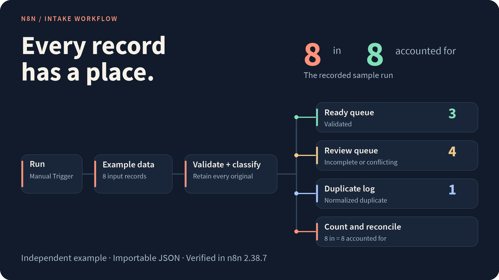

# n8n Intake

An importable workflow that sorts records into **ready**, **review** and **duplicate** outputs while retaining the original values and reconciling the totals.

<picture>
  <source media="(max-width: 600px)" srcset="docs/assets/overview-mobile.png">
  
</picture>

**[Get the workflow JSON](workflow.json)** · **[Quick start](#quick-start)** · [Rules and data](docs/rules.md) · [Verification](docs/verification.md)

[](https://github.com/jackspiece/n8n-intake-example/actions/workflows/check.yml)

Independent example · Fictional data · No credentials required · Verified with n8n 2.38.7

## Quick start

1. Open [workflow.json](workflow.json) and download the raw file.
2. Import it into a new n8n workflow.
3. Click **Execute workflow** and open the output nodes.

The example uses a Manual Trigger and Code nodes. It runs without connecting an inbox, CRM or other external service.

## What the example produces

| Output | Records | What it shows |
| --- | ---: | --- |
| **Ready queue** | 3 | Records that pass the example's checks. |
| **Review queue** | 4 | Incomplete, malformed or conflicting records. |
| **Duplicate log** | 1 | A repeated record with the same normalized fields. |
| **Count and reconcile** | 8 accounted for | Three ready + four review + one duplicate. |

Both versions of ID `002` go to review because their fields differ.

Each classified result includes **`original`**, **`normalized`**, **`changes`** and **`reasons`**. Open a queue to see the values and the decision.

## How it works

IDs stay text. Surrounding whitespace is trimmed, and only the domain of an email address is lowercased. Basic email formatting is checked; ownership and deliverability are outside the example.

Matching IDs with identical normalized fields produce a duplicate record. Conflicting versions send the whole group to review. Unknown fields and malformed inputs are preserved for review.

**Duplicate checks cover one run.** A live import would also need a persistent check against existing records. Read [the full rules and adaptation notes](docs/rules.md) before connecting a real source.

## Work on it locally

The classifier tests use Node.js 24's built-in runner and need no packages:

```sh
git clone https://github.com/jackspiece/n8n-intake-example.git
cd n8n-intake-example
npm test
```

`npm run build` regenerates the export from the same classifier and fictional records. The [verification guide](docs/verification.md) explains the separate checks for the classifier and the actual seven-node n8n execution.

## Project map

| File | Purpose |
| --- | --- |
| [workflow.json](workflow.json) | The importable n8n workflow. |
| [classify.cjs](classify.cjs) | Classification and normalization rules. |
| [example-records.json](example-records.json) | The eight fictional inputs. |
| [build-workflow.cjs](build-workflow.cjs) | Generate the export from the source files. |
| [check-execution.cjs](check-execution.cjs) | Check the actual n8n execution output. |

---

By [jackspiece](https://github.com/jackspiece), under the [MIT License](LICENSE). For a small automation project, [open an enquiry](https://github.com/jackspiece/n8n-intake-example/issues/new) with a redacted example. Scope, price and funding are agreed before client work starts. Keep private customer details out of public issues.
