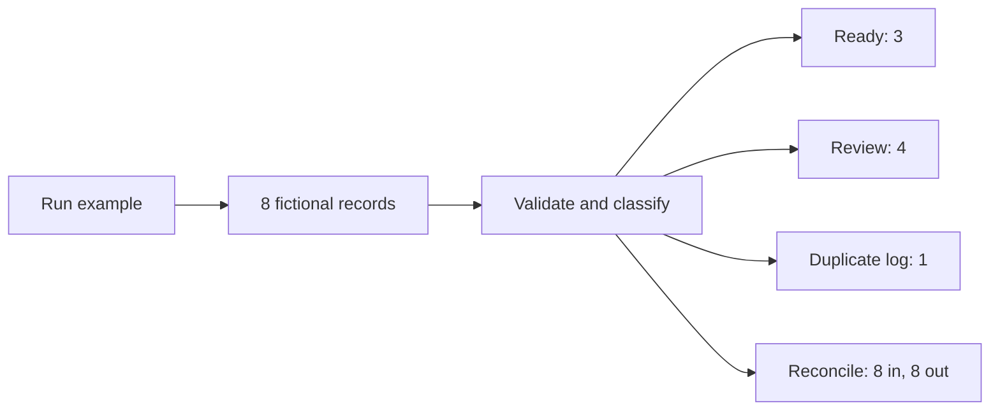

# n8n intake example

A small intake workflow that sorts incoming records into ready, review and duplicate queues. Every input stays in the output, with the original values and a record of any changes.

[](https://github.com/jackspiece/n8n-intake-example/actions/workflows/check.yml)

This is an independent example built with fictional data. It is not a client case study and does not send mail or write to a CRM.

The eight sample records should produce three ready records, four for review and one duplicate. The two conflicting versions of ID `002` both go to review. The workflow does not pick a winner.



## Try it in n8n

Import [workflow.json](workflow.json) into a new workflow and click **Execute workflow**. The example uses the Manual Trigger and Code nodes. It needs no credentials.

Open each queue to inspect its records. Each result includes `original`, `normalized`, `changes` and `reasons`. The **Count and reconcile** node shows the totals.

The example targets n8n **2.38.7**. For a real intake, replace the fictional input node with the agreed data source and field mapping. The queues are deliberately the final outputs here; connect a destination only after the review and duplicate rules have been agreed.

## Rules in this example

- IDs, names and email addresses must be text. Leading zeroes stay intact.
- Surrounding whitespace is trimmed. Only the domain of an email address is lowercased.
- Email checks cover basic format, not ownership or deliverability.
- A repeated ID with the same normalized fields is recorded as a duplicate.
- A repeated ID with different fields sends the whole group to review.
- Unknown fields and malformed inputs are preserved for review.
- These duplicate checks cover one run. A live system would also need a persistent check against records already imported.

## Local checks

The classification tests use Node 24's built-in test runner and need no packages:

```sh
npm test
```

`npm run build` regenerates the n8n export from the same classifier and example records.

The linked GitHub check also installs n8n 2.38.7, imports the actual export into a temporary database and runs it. It checks all seven nodes, the three queues, the retained original records and the final counts. Its status is shown by the badge above; the execution output is in the job log.

## Project enquiries

For a small automation or data-cleanup project, open an issue with a short description and a redacted example. Please keep private customer information out of public issues. Scope, price and payment are agreed before client work starts.

By jackspiece. Code licensed under MIT.
