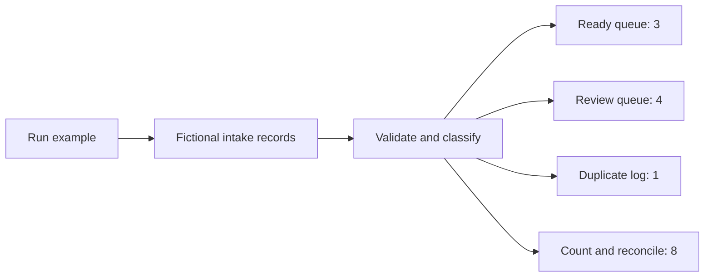

# Rules and data

[← Back to the project](../README.md)

## The example

Eight fictional records enter the workflow. Three go to the ready queue, four to review, and one to the duplicate log. The conflicting versions of ID `002` both go to review.

Every result preserves the original input and records normalized values, changes and reasons.

## Field handling

- IDs, names and email addresses must be text. Leading zeroes are preserved.
- Surrounding whitespace is trimmed.
- Only the domain of an email address is lowercased.
- Email checks cover basic format, not ownership or deliverability.
- Unknown fields and malformed inputs are kept for review.

## Duplicate handling

A repeated ID with identical normalized fields is recorded as a duplicate. A repeated ID with differing fields sends the whole group to review.

Checks apply to **one execution**. A live import would also need to check records already stored in its destination.

## The seven nodes

The reconciliation node receives the classified records directly. It checks the total alongside the three output queues.

## Adapting it

Replace the fictional input node with the agreed data source and field mapping. The queues are the final outputs in this example.

Agree on the review, duplicate and persistence rules before connecting a destination. Credentials, external delivery, mail sending and CRM writes are not part of the supplied demo.
